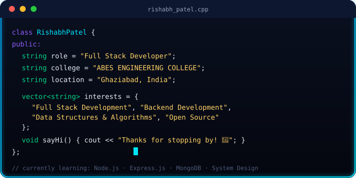
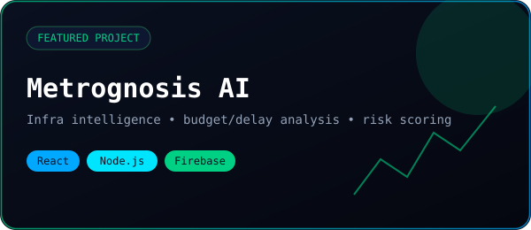
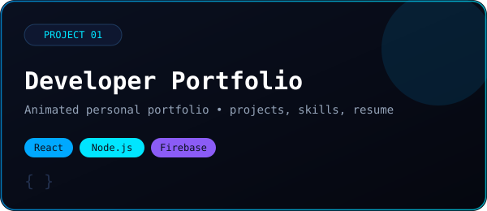
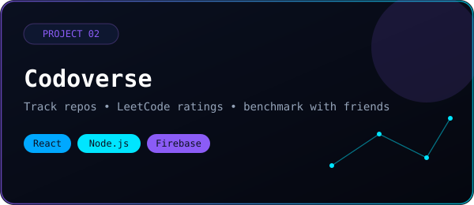

<h1>RISHABH PATEL</h1>

 

  

<samp>
<a href="#about">ABOUT</a> ·
<a href="#stack">TECH STACK</a> ·
<a href="#projects">PROJECTS</a> ·
<a href="#certifications">CERTIFICATIONS</a> ·
<a href="#coding">CODING</a> ·
<a href="#stats">STATS</a> ·
<a href="#roadmap">ROADMAP</a> ·
<a href="#contact">CONTACT</a>
</samp>

 

## 01 // About

<table>
<tr>
<td width="55%" valign="top">

</td>
<td width="45%" valign="top">

**Full Stack Developer** based in Ghaziabad, India, studying at **ABES Engineering College**.

Focused on the MERN stack, backend systems, and consistent DSA practice — currently deepening my skills in system design.

**Currently learning**
- Node.js
- Express.js
- MongoDB
- System Design

**Interests**
- Full Stack Development
- Backend Development
- Data Structures & Algorithms
- Open Source

</td>
</tr>
</table>

 

## 02 // Tech Stack

**Languages**
 

  

**Frontend**
 

  

**Backend & Database**
 

  

**Tools & Platforms**
 

 

## 03 // Featured Project

**Metrognosis AI** — An AI-powered infrastructure intelligence dashboard that tracks project lifecycles, analyzes budget revisions and delays, and provides smart risk assessment and benchmarking.

`React` `Node.js` `Firebase`

 

## Project Showcase

<table>
<tr>
<td width="50%" valign="top">

**Developer Portfolio**
Modern animated personal portfolio website showcasing my projects, skills, and resume.

`React` `Node.js` `Firebase`

</td>
<td width="50%" valign="top">

**Codoverse (Codolio)**
An interactive analytics tool to track GitHub repositories, monitor LeetCode ratings and contest history, and benchmark progress against friends.

`React` `Node.js` `Firebase`

</td>
</tr>
</table>

 

## 04 // Certifications

<table>
<tr>
<td align="center" width="50%">

🛡️ **JavaScript Algorithms**
Infosys

%20(1).pdf)

</td>
<td align="center" width="50%">

🛡️ **Data Visualization with Python**
IBM

</td>
</tr>
</table>

 

## 05 // Coding Profiles

<table>
<tr>
<th align="left">Platform</th>
<th align="left">Handle</th>
<th align="center">Link</th>
</tr>
<tr>
<td> &nbsp;<b>LeetCode</b></td>
<td><code>rishabh_patel0101</code></td>
<td align="center"></td>
</tr>
<tr>
<td> &nbsp;<b>CodeChef</b></td>
<td><code>rishabh_0102</code></td>
<td align="center"></td>
</tr>
<tr>
<td> &nbsp;<b>HackerRank</b></td>
<td><code>rishabhpatel6271</code></td>
<td align="center"></td>
</tr>
<tr>
<td> &nbsp;<b>Codeforces</b></td>
<td><code>rishabh_patel</code></td>
<td align="center"></td>
</tr>
<tr>
<td> &nbsp;<b>GeeksforGeeks</b></td>
<td><code>rishabhpa657z</code></td>
<td align="center"></td>
</tr>
</table>

 

## 06 // GitHub Stats

  
  

  

  

  

<!--
🐍 OPTIONAL: Animated Snake game out of your contribution graph
Steps:
1. GitHub repo → Settings → Actions → General → set "Workflow permissions" to Read and write
2. Create file: .github/workflows/snake.yml with the Platane/snk action (ask me and I'll generate it)
3. After first run, embed the generated svg here:

-->

 

## 07 // 2026 Roadmap

| # | Goal | Status |
|---|---|---|
| 01 | Become a MERN Stack Developer | 🔵 In progress |
| 02 | Solve 1000+ DSA Problems | 🔵 In progress |
| 03 | Build Production-Level Projects | 🔵 In progress |
| 04 | Contribute to Open Source | 🔵 In progress |
| 05 | Secure a Software Development Internship | 🔵 In progress |

 

## 08 // Contact

### Let's build something amazing.

 

━━━━━━━━━━━━━━━━━━━━━━━━━━━━━━━━━━━━━━━━━━━━━━━━━━━━

**RISHABH PATEL**

`CODE` • `DESIGN` • `BUILD` • `INNOVATE`

━━━━━━━━━━━━━━━━━━━━━━━━━━━━━━━━━━━━━━━━━━━━━━━━━━━━

